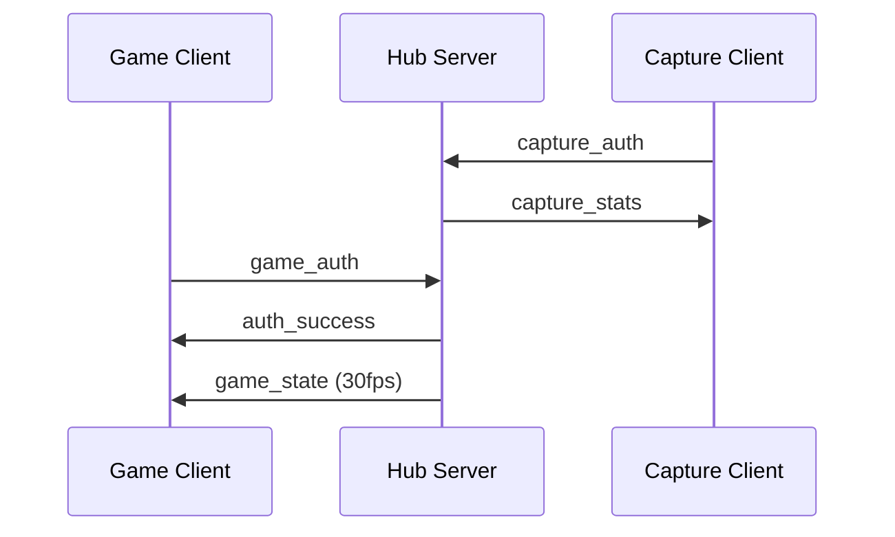
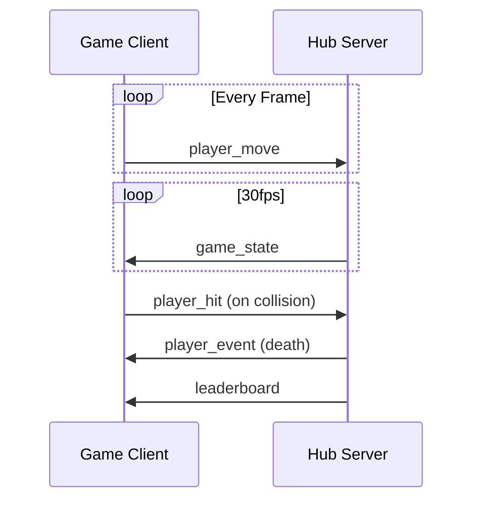
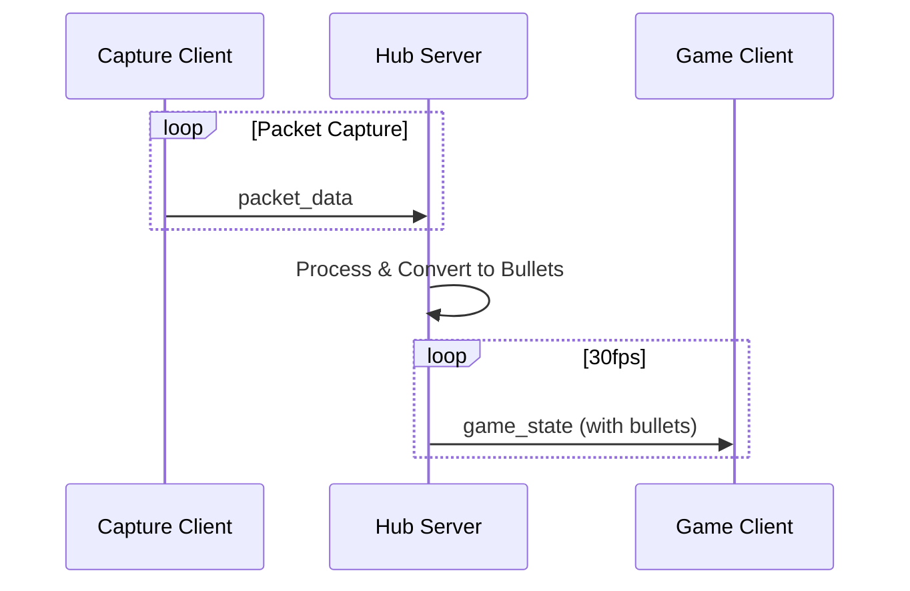

# PCAP-Nyan WebSocket通信仕様書 v1.0

## 概要

PCAP-Nyanのマルチプレイヤー対応Hub-Client通信仕様を定義します。

### アーキテクチャ
```
[Capture Clients] → [Hub Server:8766] ← [Game Clients]
                          ↓
                    [自動検索:5353]
```

### クライアントタイプ
- **Capture Client**: パケットキャプチャを実行し、Hubに送信
- **Game Client**: Webブラウザでゲームをプレイ/観戦

## 接続情報

| 項目 | 値 |
|------|-----|
| Hub WebSocket | `ws://[hub-ip]:8766` |
| 自動検索 | マルチキャスト `224.0.0.251:5353` |
| サービス名 | `_pcap-nyan-hub._tcp.local` |
| プロトコル | WebSocket + JSON |
| 文字エンコード | UTF-8 |

## TypeScript型定義

```typescript
// 基本型
type ClientType = 'capture' | 'game';
type GameMode = 'player' | 'spectator';
type GameAction = 'start' | 'restart' | 'pause';
type PlayerEvent = 'join' | 'leave' | 'death' | 'respawn';
type Protocol = 'TCP' | 'UDP' | 'ICMP' | 'UNKNOWN';

// 共通ヘッダー
interface BaseMessage {
  type: string;
  client_id?: string;
  timestamp?: number;
}

// エンティティ
interface Player {
  id: string;
  name: string;
  x: number;
  y: number;
  alive: boolean;
  hp: number;
  score: number;
  graze_count: number;
  avatar: string;
  invulnerable?: boolean;
  death_time?: number;
}

interface Bullet {
  id: string;
  x: number;
  y: number;
  vx: number;
  vy: number;
  size: number;
  protocol: Protocol;
  source: string;
  port?: number;
  color?: string;
}

interface CaptureSource {
  name: string;
  active: boolean;
  packet_rate: number;
}

interface PacketInfo {
  protocol: Protocol;
  src_port: number;
  dst_port: number;
  size: number;
  src_ip: string;
  dst_ip: string;
}

// Capture Client → Hub
interface CaptureAuthMessage extends BaseMessage {
  type: 'capture_auth';
  client_type: 'capture';
  source_name: string;
  source_id: string;
}

interface PacketDataMessage extends BaseMessage {
  type: 'packet_data';
  source_id: string;
  packets: PacketInfo[];
}

// Game Client → Hub
interface GameAuthMessage extends BaseMessage {
  type: 'game_auth';
  client_type: 'game';
  mode: GameMode;
  player_name: string;
  avatar?: string;
}

interface PlayerMoveMessage extends BaseMessage {
  type: 'player_move';
  player_id: string;
  x: number;
  y: number;
  direction?: string;
}

interface PlayerHitMessage extends BaseMessage {
  type: 'player_hit';
  player_id: string;
  bullet_id: string;
  damage?: number;
}

interface PlayerGrazeMessage extends BaseMessage {
  type: 'player_graze';
  player_id: string;
  bullet_id: string;
  distance: number;
}

interface GameControlMessage extends BaseMessage {
  type: 'game_control';
  action: GameAction;
  player_id: string;
}

interface ChatMessage extends BaseMessage {
  type: 'chat';
  player_id: string;
  message: string;
}

// Hub → Game Client
interface AuthSuccessMessage extends BaseMessage {
  type: 'auth_success';
  player_id: string;
  game_config: {
    max_bullets: number;
    game_width: number;
    game_height: number;
    difficulty: number;
  };
}

interface GameStateMessage extends BaseMessage {
  type: 'game_state';
  timestamp: number;
  players: Record<string, Player>;
  bullets: Bullet[];
  capture_sources: Record<string, CaptureSource>;
}

interface LeaderboardMessage extends BaseMessage {
  type: 'leaderboard';
  rankings: Array<{
    rank: number;
    player_id: string;
    name: string;
    score: number;
    alive: boolean;
  }>;
  high_score: number;
  total_players: number;
  active_players: number;
}

interface PlayerEventMessage extends BaseMessage {
  type: 'player_event';
  event: PlayerEvent;
  player: {
    id: string;
    name: string;
    avatar: string;
  };
}

interface ChatBroadcastMessage extends BaseMessage {
  type: 'chat_broadcast';
  player_id: string;
  player_name: string;
  message: string;
  timestamp: number;
}

// Hub → Capture Client
interface CaptureStatsMessage extends BaseMessage {
  type: 'capture_stats';
  connected_players: number;
  active_players: number;
  total_bullets: number;
  bullets_from_source: number;
}

// 自動検索
interface DiscoverMessage {
  type: 'DISCOVER';
  service: string;
  client_type: ClientType;
}

interface AnnounceMessage {
  type: 'ANNOUNCE';
  service: string;
  host: string;
  port: number;
  name: string;
  players_online: number;
  captures_active: number;
  game_mode: string;
}

// エラー
interface ErrorMessage extends BaseMessage {
  type: 'error';
  code: string;
  message: string;
  details?: any;
}
```

## Python型定義

```python
from typing import Dict, List, Optional, Literal, TypedDict, Union
from enum import Enum

# Enums
class ClientType(str, Enum):
    CAPTURE = 'capture'
    GAME = 'game'

class GameMode(str, Enum):
    PLAYER = 'player'
    SPECTATOR = 'spectator'

class GameAction(str, Enum):
    START = 'start'
    RESTART = 'restart'
    PAUSE = 'pause'

class PlayerEvent(str, Enum):
    JOIN = 'join'
    LEAVE = 'leave'
    DEATH = 'death'
    RESPAWN = 'respawn'

class Protocol(str, Enum):
    TCP = 'TCP'
    UDP = 'UDP'
    ICMP = 'ICMP'
    UNKNOWN = 'UNKNOWN'

# Base Types
class BaseMessage(TypedDict, total=False):
    type: str
    client_id: Optional[str]
    timestamp: Optional[int]

# Entities
class Player(TypedDict):
    id: str
    name: str
    x: float
    y: float
    alive: bool
    hp: int
    score: int
    graze_count: int
    avatar: str
    invulnerable: Optional[bool]
    death_time: Optional[int]

class Bullet(TypedDict):
    id: str
    x: float
    y: float
    vx: float
    vy: float
    size: float
    protocol: Protocol
    source: str
    port: Optional[int]
    color: Optional[str]

class CaptureSource(TypedDict):
    name: str
    active: bool
    packet_rate: int

class PacketInfo(TypedDict):
    protocol: Protocol
    src_port: int
    dst_port: int
    size: int
    src_ip: str
    dst_ip: str

# Message Types
class CaptureAuthMessage(BaseMessage):
    type: Literal['capture_auth']
    client_type: Literal['capture']
    source_name: str
    source_id: str

class PacketDataMessage(BaseMessage):
    type: Literal['packet_data']
    source_id: str
    packets: List[PacketInfo]

class GameAuthMessage(BaseMessage):
    type: Literal['game_auth']
    client_type: Literal['game']
    mode: GameMode
    player_name: str
    avatar: Optional[str]

class PlayerMoveMessage(BaseMessage):
    type: Literal['player_move']
    player_id: str
    x: float
    y: float
    direction: Optional[str]

class PlayerHitMessage(BaseMessage):
    type: Literal['player_hit']
    player_id: str
    bullet_id: str
    damage: Optional[int]

class PlayerGrazeMessage(BaseMessage):
    type: Literal['player_graze']
    player_id: str
    bullet_id: str
    distance: float

class GameControlMessage(BaseMessage):
    type: Literal['game_control']
    action: GameAction
    player_id: str

class ChatMessage(BaseMessage):
    type: Literal['chat']
    player_id: str
    message: str

class GameConfig(TypedDict):
    max_bullets: int
    game_width: int
    game_height: int
    difficulty: int

class AuthSuccessMessage(BaseMessage):
    type: Literal['auth_success']
    player_id: str
    game_config: GameConfig

class GameStateMessage(BaseMessage):
    type: Literal['game_state']
    timestamp: int
    players: Dict[str, Player]
    bullets: List[Bullet]
    capture_sources: Dict[str, CaptureSource]

class RankingEntry(TypedDict):
    rank: int
    player_id: str
    name: str
    score: int
    alive: bool

class LeaderboardMessage(BaseMessage):
    type: Literal['leaderboard']
    rankings: List[RankingEntry]
    high_score: int
    total_players: int
    active_players: int

class PlayerInfo(TypedDict):
    id: str
    name: str
    avatar: str

class PlayerEventMessage(BaseMessage):
    type: Literal['player_event']
    event: PlayerEvent
    player: PlayerInfo

class ChatBroadcastMessage(BaseMessage):
    type: Literal['chat_broadcast']
    player_id: str
    player_name: str
    message: str
    timestamp: int

class CaptureStatsMessage(BaseMessage):
    type: Literal['capture_stats']
    connected_players: int
    active_players: int
    total_bullets: int
    bullets_from_source: int

class DiscoverMessage(TypedDict):
    type: Literal['DISCOVER']
    service: str
    client_type: ClientType

class AnnounceMessage(TypedDict):
    type: Literal['ANNOUNCE']
    service: str
    host: str
    port: int
    name: str
    players_online: int
    captures_active: int
    game_mode: str

class ErrorMessage(BaseMessage):
    type: Literal['error']
    code: str
    message: str
    details: Optional[Dict]
```

## メッセージフロー

### 1. 接続確立フロー



### 2. ゲームプレイフロー



### 3. パケットキャプチャフロー



## エラーコード

| コード | 説明 | 詳細 |
|--------|------|------|
| `MAX_PLAYERS` | 最大プレイヤー数超過 | プレイヤー数が上限に達している |
| `INVALID_AUTH` | 認証失敗 | 不正な認証情報 |
| `DUPLICATE_ID` | ID重複 | 同じIDのクライアントが既に接続中 |
| `INVALID_MESSAGE` | 不正なメッセージ | メッセージ形式が不正 |
| `SERVER_FULL` | サーバー満員 | サーバーの処理能力上限 |
| `VERSION_MISMATCH` | バージョン不一致 | クライアントとサーバーのバージョンが非互換 |

## 実装ガイドライン

### WebSocketクライアント実装（JavaScript）

```javascript
class GameWebSocketClient {
  constructor() {
    this.ws = null;
    this.playerId = null;
  }

  connect(hubUrl = 'ws://localhost:8766') {
    this.ws = new WebSocket(hubUrl);
    
    this.ws.onopen = () => {
      this.authenticate();
    };
    
    this.ws.onmessage = (event) => {
      const message = JSON.parse(event.data);
      this.handleMessage(message);
    };
  }

  authenticate() {
    this.send({
      type: 'game_auth',
      client_type: 'game',
      mode: 'player',
      player_name: 'Player1',
      avatar: 'nyan_cat'
    });
  }

  handleMessage(message) {
    switch(message.type) {
      case 'auth_success':
        this.playerId = message.player_id;
        break;
      case 'game_state':
        this.updateGameState(message);
        break;
      case 'leaderboard':
        this.updateLeaderboard(message);
        break;
    }
  }

  send(message) {
    if (this.ws.readyState === WebSocket.OPEN) {
      this.ws.send(JSON.stringify({
        ...message,
        timestamp: Date.now()
      }));
    }
  }

  sendMove(x, y) {
    this.send({
      type: 'player_move',
      player_id: this.playerId,
      x: x,
      y: y
    });
  }
}
```

### WebSocketクライアント実装（Python）

```python
import asyncio
import json
import websockets
from typing import Dict, Any

class CaptureWebSocketClient:
    def __init__(self, source_id: str, source_name: str):
        self.source_id = source_id
        self.source_name = source_name
        self.ws = None
    
    async def connect(self, hub_url: str = 'ws://localhost:8766'):
        self.ws = await websockets.connect(hub_url)
        await self.authenticate()
        await self.run()
    
    async def authenticate(self):
        await self.send({
            'type': 'capture_auth',
            'client_type': 'capture',
            'source_name': self.source_name,
            'source_id': self.source_id
        })
    
    async def send(self, message: Dict[str, Any]):
        if self.ws:
            await self.ws.send(json.dumps(message))
    
    async def send_packet_data(self, packets: List[PacketInfo]):
        await self.send({
            'type': 'packet_data',
            'source_id': self.source_id,
            'packets': packets
        })
    
    async def run(self):
        async for message in self.ws:
            data = json.loads(message)
            await self.handle_message(data)
    
    async def handle_message(self, message: Dict[str, Any]):
        if message['type'] == 'capture_stats':
            print(f"Stats: {message}")
```

### 自動検索実装

```python
import socket
import json
import struct

class HubDiscovery:
    MULTICAST_GROUP = '224.0.0.251'
    MULTICAST_PORT = 5353
    SERVICE_NAME = '_pcap-nyan-hub._tcp.local'
    
    @staticmethod
    def discover_hub(timeout: float = 5.0) -> Optional[Dict]:
        """Hubを検索し、接続情報を返す"""
        sock = socket.socket(socket.AF_INET, socket.SOCK_DGRAM)
        sock.settimeout(timeout)
        
        # マルチキャストグループに参加
        sock.setsockopt(socket.SOL_SOCKET, socket.SO_REUSEADDR, 1)
        
        # Discoverメッセージ送信
        discover_msg = json.dumps({
            'type': 'DISCOVER',
            'service': HubDiscovery.SERVICE_NAME,
            'client_type': 'game'
        })
        
        sock.sendto(
            discover_msg.encode('utf-8'),
            (HubDiscovery.MULTICAST_GROUP, HubDiscovery.MULTICAST_PORT)
        )
        
        try:
            # 応答待機
            data, addr = sock.recvfrom(1024)
            response = json.loads(data.decode('utf-8'))
            
            if response.get('type') == 'ANNOUNCE':
                return {
                    'host': response['host'],
                    'port': response['port'],
                    'name': response['name']
                }
        except socket.timeout:
            return None
        finally:
            sock.close()
```

## パフォーマンス考慮事項

### 推奨設定値

| パラメータ | 推奨値 | 説明 |
|------------|--------|------|
| game_state更新頻度 | 30fps | ゲーム状態の同期頻度 |
| player_move送信頻度 | 最大60fps | プレイヤー移動の送信頻度 |
| packet_data送信間隔 | 100-200ms | パケットデータのバッチ送信間隔 |
| 最大同時弾数 | 500 | 画面上の最大弾数 |
| 最大プレイヤー数 | 10 | 同時接続プレイヤー数 |
| WebSocketバッファサイズ | 64KB | メッセージバッファサイズ |

### 最適化のポイント

1. **バッチ処理**: packet_dataは複数パケットをまとめて送信
2. **差分更新**: 可能な限り変更部分のみ送信
3. **圧縮**: 大量データは圧縮を検討
4. **優先度制御**: 重要なメッセージを優先的に処理

## バージョン管理

| バージョン | 日付 | 変更内容 |
|------------|------|----------|
| 1.0 | 2025-01-07 | 初版リリース |

## 互換性

- WebSocket: RFC 6455準拠
- JSON: RFC 8259準拠
- 文字エンコード: UTF-8
- タイムスタンプ: Unix時間（ミリ秒）